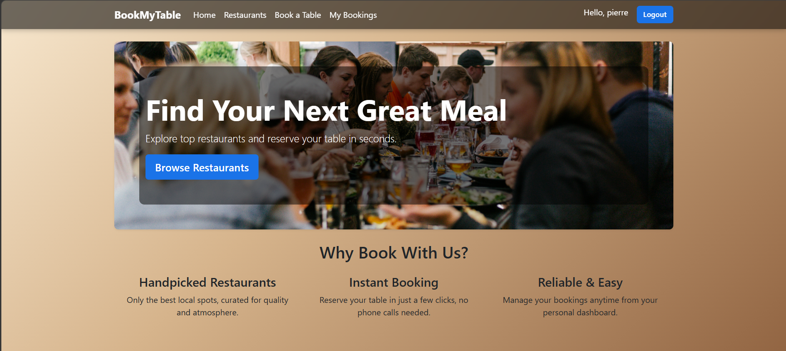
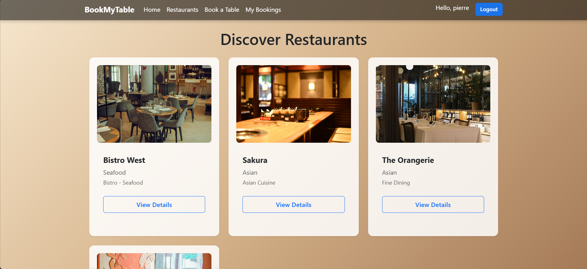
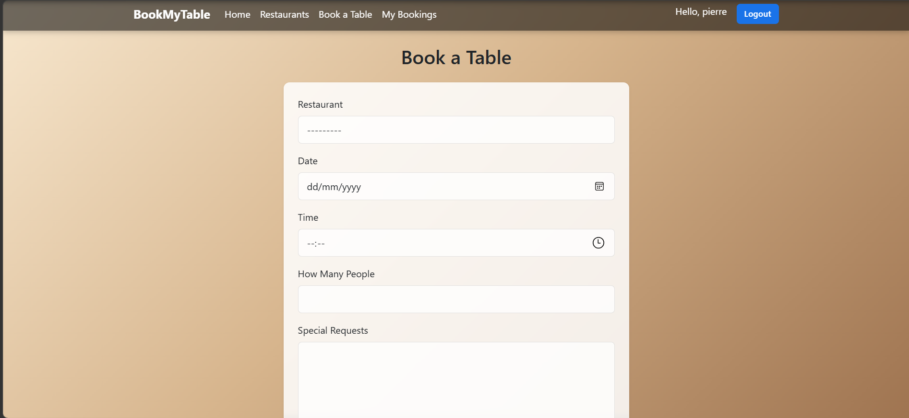
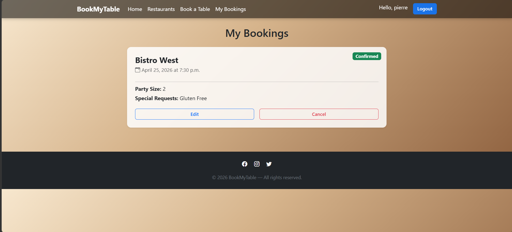
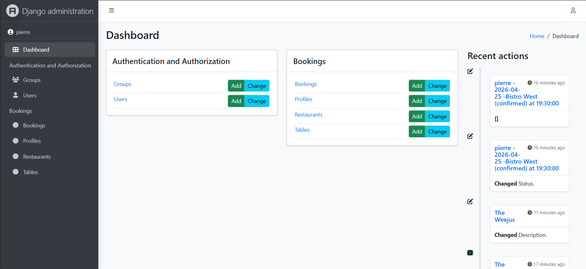

# 📘 BookMyTable — Restaurant Booking Platform


BookMyTable is a full‑stack restaurant booking platform built with Django, designed to provide a seamless and intuitive reservation experience for users while giving restaurant owners a simple and efficient way to manage bookings. The application focuses on clean UX, accessibility, and real‑world workflows, offering a polished and responsive interface across all devices.

Users can browse restaurants, view details, make bookings, and manage their reservations. Admins can approve or reject bookings, manage restaurant data, and oversee user activity through a modern Jazzmin‑styled dashboard. The project demonstrates strong backend logic, relational database design, and a user‑centred approach to interface design.


---

# 🎯 Rationale & Target Audience

BookMyTable was created to solve a real‑world problem: small restaurants often lack a simple, intuitive online booking system.  
The target audience includes:

- **Restaurant customers** who want a fast, mobile‑friendly way to book a table  
- **Restaurant owners/admins** who need an easy way to manage reservations  
- **Users with accessibility needs**, thanks to clear navigation, semantic HTML, and responsive design  

The purpose of the application is immediately clear to new users:  

➡️ *Browse restaurants → Book a table → Manage your bookings.*

---

# 🧑‍🤝‍🧑 User Stories

### **As a user, I want to:**
- Create an account so I can manage my bookings.
- Log in securely so only I can access my dashboard.
- Browse restaurants with images and descriptions.
- View detailed restaurant information before booking.
- Make a reservation with date, time, party size, and special requests.
- See the status of my bookings (Pending / Accepted / Rejected).
- Edit or cancel my bookings if my plans change.
- Use the site easily on mobile devices.

### **As an admin, I want to:**
- Log into a secure admin dashboard.
- Add, edit, or delete restaurants.
- View all bookings in one place.
- Approve or reject bookings with one click.
- Manage users and restaurant tables.
- Ensure the system runs smoothly with no broken links or errors.

---


# 🧩 Features


## 👤 User Features

- Create an account & log in  
- Browse restaurants with images and descriptions  
- Make a reservation with:
  - Date picker  
  - Time picker  
  - Party size  
  - Special requests  
- View all bookings in a clean dashboard  
- Edit or cancel bookings  
- See booking status:
  - **Pending** (yellow)  
  - **Accepted** (green)  
  - **Rejected** (red)

## 🛠️ Admin Features

- Manage restaurants, tables, profiles, and bookings  
- Approve or reject bookings  
- Jazzmin‑styled admin panel  
- Filter bookings by status  
- Edit bookings directly from the list view  

## 🎨 UX & Accessibility Features

BookMyTable follows key UX principles:

### **Information Hierarchy**
- Restaurant cards use clear headings, images, and spacing  
- Booking cards highlight the most important information first  
- Navigation is consistent across all pages  

### **User Control**
- Users initiate all actions (no autoplay, no pop‑ups)  
- Clear feedback after every action (booking created, updated, deleted)  
- Status badges give immediate clarity  

### **Consistency**
- Same layout structure across all pages  
- Consistent button styles, spacing, and typography  

### **Accessibility**
- Semantic HTML  
- High‑contrast buttons  
- Large tap targets on mobile  
- Native date/time pickers  
- Alt text on images  

---


# Screenshots

### Home Page:



### Restaurant list:



### Booking From:



### My bookings Dashboard:



### Admin Panel (Jazzmin):



---

# WIREFRAME 

Below is a simple wireframe representing the core user flow.
```
[ Homepage ]
      |
      v
[ Restaurant List ]
      |
      v
[ Restaurant Detail ]
      |
      v
[ Booking Form ]
      |
      v
[ Booking Confirmation ]
      |
      v
[ My Bookings Dashboard ]
```


---

# 🗂️ Database Schema

The application uses a relational database with the following structure:

## **Restaurant**
| Field | Type | Notes |
|-------|------|-------|
| id | PK | Auto |
| name | CharField | Required |
| description | TextField | |
| image | ImageField | |
| location | CharField | |

## **Booking**
| Field | Type | Notes |
|-------|------|-------|
| id | PK | Auto |
| user | FK → User | Required |
| restaurant | FK → Restaurant | Required |
| date | DateField | Required |
| time | TimeField | Required |
| party_size | IntegerField | Required |
| special_requests | TextField | Optional |
| status | CharField | pending/accepted/rejected |

## **Profile**
| Field | Type | Notes |
|-------|------|-------|
| user | OneToOne → User | Required |
| phone | CharField | Optional |
| preferences | TextField | Optional |

### **Schema Summary**
The schema is designed to support a realistic restaurant booking workflow, with clear relationships between users, restaurants, and bookings.  

---

# 🔄 Booking Workflow

1. User submits a booking → **Pending**  
2. Admin reviews booking in Jazzmin admin  
3. Admin sets status to:
   - **Accepted**  
   - **Rejected**  
4. User sees updated status in “My Bookings”

This mirrors real restaurant workflows and improves UX clarity.

---

# 🧪 Testing

A full manual testing process was carried out on both the development and deployed versions of the application. All core features, views, forms, and CRUD operations were tested to ensure correct behaviour, responsiveness, and data integrity.

---

## ✔ 1. User Journey Testing

| Feature | Test Performed | Expected Result | Outcome |
|--------|----------------|----------------|---------|
| Register | Submit valid form | Account created | ✔ |
| Login | Enter valid credentials | Redirect to homepage | ✔ |
| Logout | Click logout | User logged out | ✔ |
| Navigation | Click all menu links | No broken links | ✔ |
| Mobile Layout | Resize browser / dev tools | Layout adapts correctly | ✔ |

---

## ✔ 2. Restaurant Functionality Testing

| Feature | Test Performed | Expected Result | Outcome |
|--------|----------------|----------------|---------|
| Restaurant List | Load `/restaurants/` | All restaurants displayed | ✔ |
| Restaurant Detail | Click restaurant card | Correct restaurant details shown | ✔ |
| Static Images | Load list/detail pages | Images load correctly | ✔ |

---

## ✔ 3. Booking System Testing

| Feature | Test Performed | Expected Result | Outcome |
|--------|----------------|----------------|---------|
| Create Booking | Submit valid form | Booking saved as **Pending** | ✔ |
| Invalid Booking | Submit empty form | Validation errors shown | ✔ |
| Edit Booking | Update date/time | Changes saved | ✔ |
| Cancel Booking | Click delete | Booking removed | ✔ |
| Booking Status | Admin updates status | User sees Accepted/Rejected | ✔ |

---

## ✔ 4. Authentication & Permissions Testing

| Scenario | Expected Behaviour | Outcome |
|----------|--------------------|---------|
| Logged‑out user visits `/my-bookings/` | Redirect to login | ✔ |
| Logged‑out user visits `/book/` | Redirect to login | ✔ |
| User edits another user’s booking | Access denied | ✔ |
| Admin access | Only admin can access Django admin | ✔ |

---

## ✔ 5. Admin Panel Testing

| Feature | Test | Expected Result | Outcome |
|--------|------|----------------|---------|
| Add Restaurant | Create new restaurant | Saved successfully | ✔ |
| Edit Restaurant | Update details | Changes visible on site | ✔ |
| Approve Booking | Change status | User sees update | ✔ |
| Delete Booking | Remove booking | Removed from DB | ✔ |

---

## ✔ 6. Code Validation

- **HTML** validated using W3C  
- **CSS** validated using Jigsaw  
- **Python** checked with PEP8 standards  
- **No major issues found**

> **Note:** Bootstrap 5.3.2 CDN triggers false‑positive CSS validator errors due to modern CSS features not yet supported by the validator. These do not affect project code.

---

## ✔ 7. Overall Testing Conclusion

All core features of the application were thoroughly tested, including CRUD operations, authentication, navigation, responsiveness, and admin workflows.  
The application behaves consistently across devices and screen sizes, and no unresolved bugs remain.  
The deployed version matches the development version in functionality and performance.

---

# 🚀 Deployment

The project was deployed using **Render**.

### Deployment Steps

1. Push project to GitHub  
2. Create a new Render Web Service  
3. Connect GitHub repository  
4. Add environment variables:  
   - `SECRET_KEY`  
   - `DEBUG=False`  
5. Add build command:  

---

# 🚀 Future Enhancements

The following features are planned for future versions of BookMyTable:

### **1. Restaurant Image Uploads**
Allow restaurant owners to upload images directly through the admin panel using a cloud storage service (e.g., Cloudinary).

### **2. Email Notifications**
Send automatic emails when:
- A booking is created
- A booking is accepted or rejected
- A booking is cancelled

### **3. Search & Filters**
Add filtering by:
- Cuisine
- Location
- Opening hours
- Availability

### **4. Table Availability Logic**
Prevent double‑booking by checking table capacity and availability in real time.

### **5. User Profile Page**
Allow users to update:
- Phone number
- Preferences
- Profile picture (optional)

### **6. Restaurant Reviews**
Enable users to leave ratings and comments after visiting a restaurant.

### **7. Google Maps Integration**
Display restaurant locations visually on a map.

---

# 🛠️ Version Control

- Git used throughout development  
- Small, descriptive commits for each feature    
- Clear commit history showing development process  


---

# 🔐 Security Features

- Secret key stored in environment variable  
- DEBUG = False in production  
- No secrets committed to GitHub  
- User permissions enforced (only owners can edit/delete their bookings)  


---

# 📦 Installation

```bash
git clone <repo-url>
cd restaurant-booking
pip install -r requirements.txt
python manage.py migrate
python manage.py runserver
```

## 🛠️ Bugs & Fixes

### Static files not loading (Jazzmin)
- Fixed by correcting `STATIC_URL` to `/static/`  
- Added `STATIC_ROOT` and ran `collectstatic`  
- Ensured `DEBUG=True` for development  

### Time format confusion
- Replaced text input with native `<input type="time">`  
- Added widget in Django form  

### Admin theme conflict
- Removed Django Suit (incompatible with Django 6)  
- Installed Jazzmin instead  

---


# 🏁 Conclusion

BookMyTable is a fully functional, responsive, and user‑friendly restaurant booking system that meets all requirements for a full‑stack Django application. It demonstrates:

- Clean UX and accessibility
- Strong backend logic and database design
- Full CRUD functionality
- Secure authentication and permissions
- Professional deployment on Render
- Clear documentation and testing

The project is stable, polished, and ready for assessment. It provides real value to both users and restaurant owners, and it lays a solid foundation for future enhancements.


# Credits

- **Django Documentation** — backend logic and best practices  
- **Bootstrap 5** — responsive layout and grid system  
- **Jazzmin** — modern admin panel styling  
- **Code Institute** — project structure guidance and assessment criteria  
- All images used are either custom or sourced from free‑to‑use libraries  
- Images from Pexels thanks to : 
- Kunal Lakhotia - weejus restaurant
- Olaseni Omoare - bistro west
- Ayşegül - orangerie & Sakura


# 🔗 Live Demo & Project Links

### 🚀 Live Demo  
The deployed project is available here:  
👉 **https://restaurant-booking-qcpf.onrender.com/**

### 📂 GitHub Repository  
Full source code available on GitHub:  
👉 **https://github.com/Pierre-Louis789/restaurant-booking**

### 👤 Developer Profile  
Created by Pierre-Louis — view my GitHub profile:  
👉 **https://github.com/Pierre-Louis789**