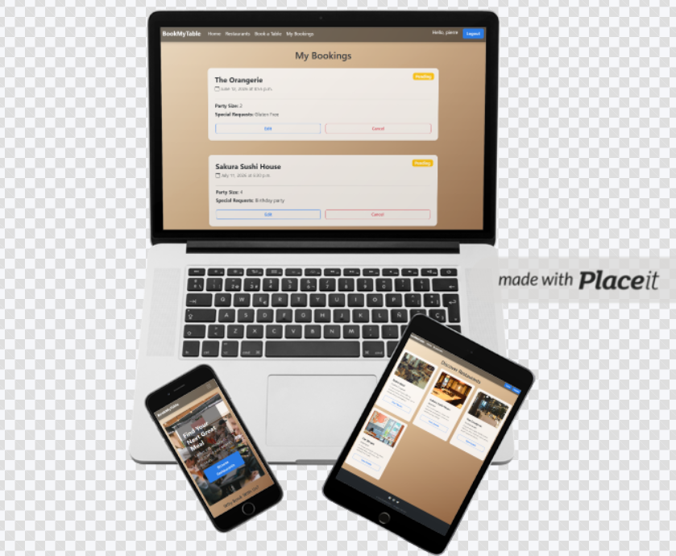
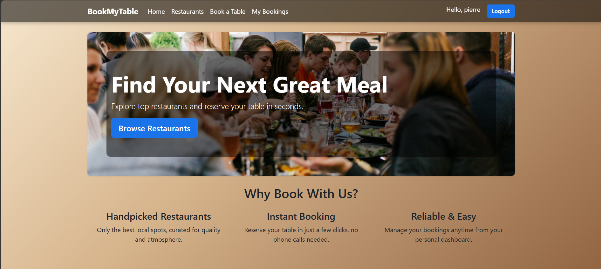
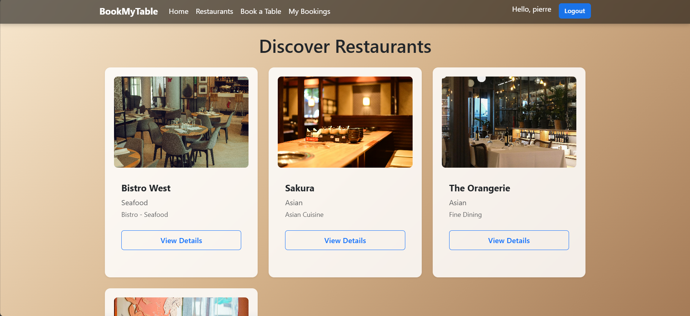
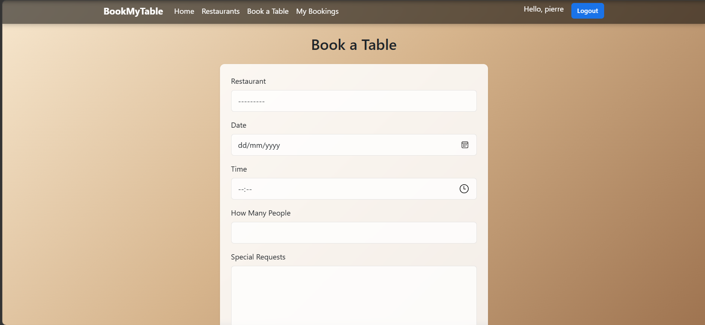
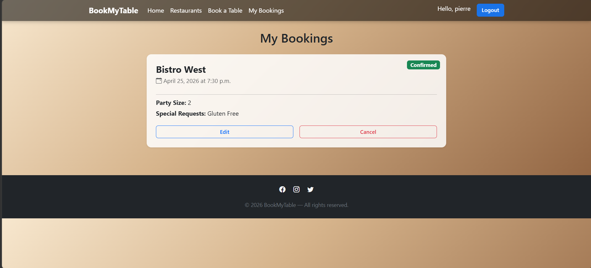
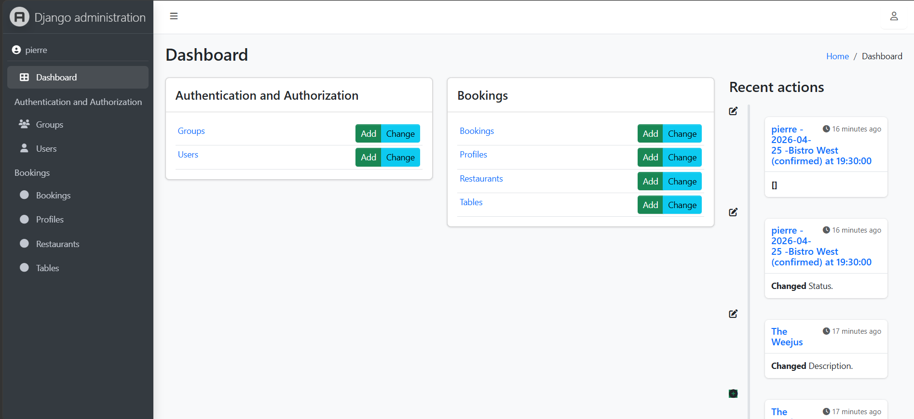
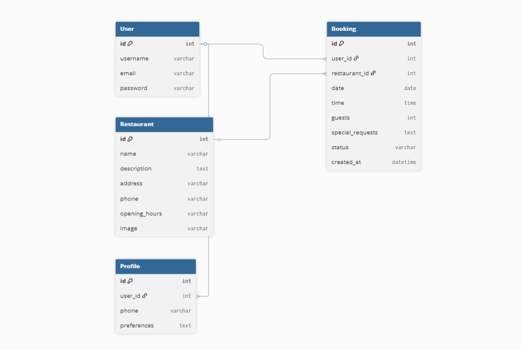
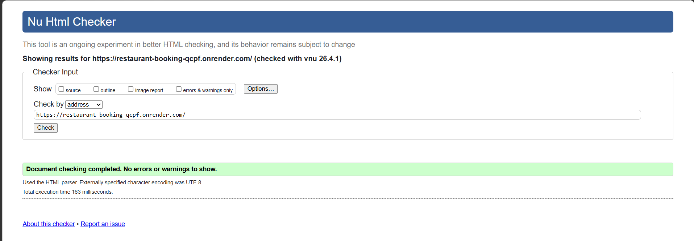
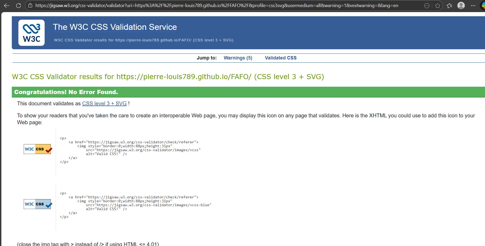
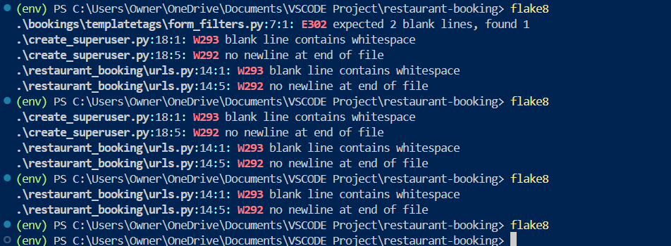

# 📘 BookMyTable — Restaurant Booking Platform


BookMyTable is a full‑stack restaurant booking platform built with Django, designed to provide a seamless and intuitive reservation experience for users while giving restaurant owners a simple and efficient way to manage bookings. The application focuses on clean UX, accessibility, and real‑world workflows, offering a responsive interface across all devices.

Users can browse restaurants, view details, make bookings, and manage their reservations. Admins can approve or reject bookings, manage restaurant data, add new restaurants and oversee user activity through a modern Jazzmin‑styled dashboard. The project demonstrates strong backend logic, relational database design, and a user‑centred approach to interface design.

The project demonstrates:

- A data‑driven full‑stack web application
- A relational database with clear relationships between users, restaurants, and bookings
- Validated HTML and CSS
- Python code following PEP8 conventions
- Secure deployment using environment variables on Render

---

### 📑 Table of Contents


1. [Rationale & Target Audience](#rationale--target-audience)
2. [User Stories](#user-stories)
3. [Features](#features)
   - [User Features](#user-features)
   - [Admin Features](#admin-features)
   - [UX & Accessibility Features](#ux--accessibility-features)
4. [Screenshots](#screenshots)
5. [Wireframe & User Flow](#wireframe--user-flow)
6. [Database Schema](#database-schema)
7. [Booking Workflow](#booking-workflow)
8. [Testing](#testing)
   - [User Journey Testing](#1-user-journey-testing)
   - [Restaurant Functionality Testing](#2-restaurant-functionality-testing)
   - [Booking System Testing](#3-booking-system-testing)
   - [Authentication & Permissions Testing](#4-authentication--permissions-testing)
   - [Admin Panel Testing](#5-admin-panel-testing)
   - [Code Validation](#6-code-validation)
   - [Security Testing](#security-testing)
   - [Lighthouse Testing](#lighthouse-testing)
   - [Overall Testing Conclusion](#7-overall-testing-conclusion)
9. [Deployment](#deployment)
10. [Database Seeding & Deployment Context](#database-seeding--deployment-context)
11. [Future Enhancements](#future-enhancements)
12. [Version Control](#version-control)
13. [Installation](#installation)
14. [Bugs & Fixes](#bugs--fixes)
15. [Conclusion](#conclusion)
16. [Credits](#credits)
17. [Live Demo & Project Links](#live-demo--project-links)


---

#  Rationale & Target Audience

BookMyTable was developed to address a common real‑world problem: many small and medium‑sized restaurants lack a simple, accessible, and mobile‑friendly online booking system. Existing solutions are often expensive, overly complex, or not optimised for users with accessibility needs.

The application provides a clear, intuitive workflow:

➡️ **Browse restaurants → View details → Book a table → Manage bookings**

This purpose is immediately evident to new users, fulfilling key UX and accessibility requirements.

##  Target Audience

### **1. Restaurant Customers**
- Want a fast, easy way to book a table online  
- Prefer a clean, mobile‑friendly interface  
- Need clear confirmation and booking status updates  
- Benefit from accessible design (semantic HTML, labels, contrast, keyboard navigation)

### **2. Restaurant Owners / Admins**
- Need a simple dashboard to manage bookings  
- Want to approve or reject reservations quickly  
- Require a reliable system that prevents double‑booking  
- Prefer a modern admin interface (Jazzmin)

### **3. Users With Accessibility Needs**
- Benefit from:
  - Semantic HTML structure  
  - Clear heading hierarchy  
  - High‑contrast buttons  
  - Large tap targets  
  - Keyboard‑friendly navigation  
  - Alt text on all images  

##  Why This Project Was Built

BookMyTable demonstrates:

- A fully functional **data‑driven full‑stack application**  
- A relational database with meaningful relationships  
- Clean UX and responsive design  
- Accessibility‑focused development  
- Secure deployment using environment variables  
- Realistic CRUD workflows for both users and admins  

This section satisfies by clearly explaining:

- The **purpose** of the application  
- The **value** it provides  
- The **target audience**  
- The **UX and accessibility considerations**  


---

---

#  User Stories

The following user stories guided the design and development of BookMyTable.  
They ensure the application meets real user needs, supports accessibility, and provides a clear, intuitive booking workflow.

##  User Stories — Customers

- **As a user, I want to create an account** so I can manage my bookings securely.
- **As a user, I want to log in and log out easily** so I can access my dashboard safely.
- **As a user, I want to browse restaurants** so I can choose a place that suits my preferences.
- **As a user, I want to view restaurant details** so I can make an informed decision before booking.
- **As a user, I want to make a reservation** by selecting a date, time, and number of guests.
- **As a user, I want to see the status of my bookings** (Pending / Accepted / Rejected) so I know if my reservation is confirmed.
- **As a user, I want to edit or cancel my bookings** so I can update my plans if needed.
- **As a user, I want the site to be responsive and accessible** so I can use it comfortably on any device.

##  User Stories — Admins

- **As an admin, I want to log into a secure dashboard** so I can manage the system.
- **As an admin, I want to add, edit, or delete restaurants** so I can keep the platform up to date.
- **As an admin, I want to view all bookings** so I can manage reservations efficiently.
- **As an admin, I want to approve or reject bookings** so I can control restaurant availability.
- **As an admin, I want a clean, modern interface** so I can work quickly and avoid errors.

##  Accessibility‑Focused User Stories

- **As a user with accessibility needs, I want clear headings and labels** so I can navigate the site easily.
- **As a user with low vision, I want high‑contrast buttons and readable text** so I can interact with the interface comfortably.
- **As a keyboard‑only user, I want all interactive elements to be focusable** so I can use the site without a mouse.
- **As a screen‑reader user, I want meaningful alt text on images** so I can understand visual content.


---

#  Features

BookMyTable includes a full set of user‑facing and admin‑facing features designed to create a smooth, accessible, and intuitive booking experience. The platform follows UX best practices, provides clear user feedback, and supports all required CRUD operations.

##  User Features

- **Account Management**
  - Register, log in, and log out securely
  - Authentication‑protected pages (My Bookings, Booking Form)

- **Restaurant Browsing**
  - View a list of restaurants with images and descriptions
  - Click into a detailed restaurant page with full information

- **Booking System**
  - Create a booking with:
    - Date picker  
    - Time picker  
    - Number of guests  
    - Optional special requests  
  - View all bookings in a clean dashboard
  - Edit or cancel existing bookings
  - See booking status:
    - **Pending** (yellow)
    - **Accepted** (green)
    - **Rejected** (red)

- **Responsive & Accessible UI**
  - Fully responsive layout (mobile, tablet, desktop)
  - Semantic HTML and labelled form fields
  - High‑contrast buttons and clear focus states
  - Alt text on all images

##  Admin Features

- **Restaurant Management**
  - Add, edit, or delete restaurants
  - Upload restaurant images
  - Manage descriptions, opening hours, and contact details

- **Booking Management**
  - View all bookings in the admin panel
  - Approve or reject bookings with one click
  - Edit bookings directly from the list view

- **Admin Dashboard**
  - Jazzmin‑styled interface for a modern, clean experience
  - Filters for booking status and restaurant

##  UX & Accessibility Features

BookMyTable follows key UX and accessibility principles:

### **Information Hierarchy**
- Clear headings and structured content
- Restaurant cards highlight the most important details first
- Booking dashboard uses badges for instant status recognition

### **User Control & Feedback**
- Users initiate all actions (no auto‑actions)
- Success and error messages appear after every form submission
- Buttons and links are consistently styled and predictable

### **Consistency**
- Same layout structure across all pages
- Consistent spacing, typography, and button styles
- Navigation bar remains visible and intuitive

### **Accessibility**
- Semantic HTML5 structure
- Proper heading hierarchy (H1 → H2 → H3)
- Alt text on all images
- Keyboard‑friendly navigation
- High‑contrast colours and large tap targets

### **Responsive Layout**
- Mobile‑first design
- Flexible grid system using Bootstrap 5
- Cards, forms, and navigation adapt to all screen sizes



- This screenshots demonstrates the responsive layout on all devices

---


# Screenshots

### Home Page:



### Restaurant list:



### Booking From:



### My bookings Dashboard:



### Admin Panel (Jazzmin):


 

---

#  Wireframe & User Flow

The following wireframe illustrates the core user journey within BookMyTable.  
It shows how users move through the application from browsing restaurants to managing their bookings.  
This simple flow also demonstrates that the purpose of the application is immediately clear and the navigation intuitive.


```
[ Homepage ]
      |
      v
[ Restaurant List ]
      |
      v
[ Restaurant Detail ]
      |
      v
[ Booking Form ]
      |
      v
[ Booking Confirmation ]
      |
      v
[ My Bookings Dashboard ]
```

###  User Flow Summary

- **Homepage** introduces the platform and provides clear navigation.
- **Restaurant List** displays all available restaurants with images and descriptions.
- **Restaurant Detail** gives users the information they need before booking.
- **Booking Form** allows users to select date, time, and party size.
- **Booking Confirmation** provides immediate feedback after submission.
- **My Bookings Dashboard** lets users view, edit, or cancel their reservations.

This flow ensures a smooth, intuitive experience.


---


#  Database Schema

BookMyTable uses a relational database designed to support a realistic restaurant booking workflow.  
The schema is normalised, efficient, and clearly defines the relationships between users, restaurants, and bookings.

##  Entity Relationship Diagram (ERD)




---

##  Cardinality

Cardinality describes how many records in one table relate to records in another table.  
It is essential for designing a clear, efficient relational database and is a key part of the assessment criteria.

BookMyTable uses three types of cardinality:

### **1. One‑to‑Many (1 → ∞)**  
This is the most common relationship in the project.

#### **User → Booking (1 → ∞)**
- One user can create **many** bookings  
- Each booking belongs to **one** user  
- Enforced through `Booking.user_id` (ForeignKey → User)

#### **Restaurant → Booking (1 → ∞)**
- One restaurant can have **many** bookings  
- Each booking is linked to **one** restaurant  
- Enforced through `Booking.restaurant_id` (ForeignKey → Restaurant)

These relationships reflect real‑world behaviour:  
A user can make multiple reservations, and a restaurant can receive multiple bookings.

---

### **2. One‑to‑One (1 → 1)**  
Used when one record should have exactly one related record.

#### **User → Profile (1 → 1)**
- Each user has **one** profile  
- Each profile belongs to **one** user  
- Enforced through `Profile.user` (OneToOneField → User)

This allows optional extra information (phone, preferences) without modifying the core User model.

---

### **3. No Many‑to‑Many Relationships**
BookMyTable does **not** require any many‑to‑many relationships because:

- A booking always belongs to exactly one user  
- A booking always belongs to exactly one restaurant  
- Restaurants do not need to be grouped or tagged  
- Users do not need to follow or favourite restaurants  

This keeps the schema simple, efficient, and perfectly suited to the project’s purpose.

---

##  Why Cardinality Matters in This Project

Understanding cardinality ensures:

- **Data integrity** (no orphaned bookings)  
- **Correct CRUD behaviour** (users can only edit their own bookings)  
- **Efficient queries** (e.g., fetch all bookings for a restaurant)  
- **A realistic workflow** (mirrors real restaurant booking systems)  


---

##  Models Overview

### **User (Django Auth Model)**
Provided by Django.  
Stores authentication details and identifies who created each booking.

### **Restaurant Model**
Stores all restaurant‑specific information.

| Field | Type | Description |
|-------|------|-------------|
| `id` | PK | Auto‑generated |
| `name` | CharField | Restaurant name |
| `description` | TextField | Overview of the restaurant |
| `address` | CharField | Location/address |
| `phone` | CharField | Contact number |
| `opening_hours` | CharField | Opening times |
| `image` | ImageField | Restaurant image |

### **Booking Model**
Stores reservation details and links users to restaurants.

| Field | Type | Description |
|-------|------|-------------|
| `id` | PK | Auto‑generated |
| `user` | FK → User | User who made the booking |
| `restaurant` | FK → Restaurant | Restaurant being booked |
| `date` | DateField | Booking date |
| `time` | TimeField | Booking time |
| `guests` | IntegerField | Number of guests |
| `special_requests` | TextField | Optional notes |
| `status` | CharField | Pending / Accepted / Rejected |
| `created_at` | DateTimeField | Auto timestamp |

### **Profile Model**
Extends the User model with optional extra information.

| Field | Type | Description |
|-------|------|-------------|
| `user` | OneToOne → User | Linked user |
| `phone` | CharField | Optional phone number |
| `preferences` | TextField | Optional notes |

---

##  Why This Schema Fits the Purpose

This schema was designed to support a real restaurant booking workflow:

- Users can **create, edit, and delete** their bookings  
- Restaurants can have **multiple bookings**  
- Admins can **approve or reject** reservations  
- The Booking table stores all reservation data in a clean, normalised structure  
- Foreign keys ensure **data integrity** and prevent orphaned records  
- The structure supports all CRUD operations required by the assessment  


---

#  Booking Workflow

BookMyTable follows a clear and intuitive booking workflow that mirrors how real restaurants handle reservations. This ensures users always understand what stage their booking is at and what actions they can take next.

##  How the Booking Process Works

1. **User selects a restaurant**  
   From the restaurant list or detail page, the user chooses where they want to book.

2. **User completes the booking form**  
   They select:
   - Date  
   - Time  
   - Number of guests  
   - Optional special requests  

3. **Booking is created as “Pending”**  
   The booking is saved and appears in the user’s dashboard with a yellow **Pending** badge.

4. **Admin reviews the booking**  
   In the Django admin panel, the restaurant owner/admin can:
   - Accept the booking  
   - Reject the booking  
   - Edit booking details if needed  

5. **Status is updated**  
   The user sees the updated status in their dashboard:
   - **Accepted** (green)  
   - **Rejected** (red)  

6. **User can manage their booking**  
   From the dashboard, users can:
   - Edit the booking  
   - Cancel the booking  
   - View all past and upcoming reservations  

---

##  Workflow Summary

**User → Booking Form → Pending → Admin Review → Accepted/Rejected → User Dashboard**


This workflow provides:
- Clear communication  
- Full user control  
- A realistic reservation process  
- A smooth experience from start to finish  


---

#  Testing

A full manual testing process was carried out on both the development and deployed versions of the application. All core features, views, forms, and CRUD operations were tested to ensure correct behaviour, responsiveness, and data integrity.

---

##  1. User Journey Testing

| Feature | Test Performed | Expected Result | Outcome |
| --- | --- | --- | --- |
| Register | Submit valid form | Account created | ✔ |
| Login | Enter valid credentials | Redirect to homepage | ✔ |
| Logout | Click logout | User logged out | ✔ |
| Navigation | Click all menu links | No broken links | ✔ |
| Mobile Layout | Resize browser / dev tools | Layout adapts correctly | ✔ |

---

##  2. Restaurant Functionality Testing

| Feature | Test Performed | Expected Result | Outcome |
|--------|----------------|----------------|---------|
| Restaurant List | Load `/restaurants/` | All restaurants displayed | ✔ |
| Restaurant Detail | Click restaurant card | Correct restaurant details shown | ✔ |
| Static Images | Load list/detail pages | Images load correctly | ✔ |

---

##  3. Booking System Testing

| Feature | Test Performed | Expected Result | Outcome |
|--------|----------------|----------------|---------|
| Create Booking | Submit valid form | Booking saved as **Pending** | ✔ |
| Invalid Booking | Submit empty form | Validation errors shown | ✔ |
| Edit Booking | Update date/time | Changes saved | ✔ |
| Cancel Booking | Click delete | Booking removed | ✔ |
| Booking Status | Admin updates status | User sees Accepted/Rejected | ✔ |

---

##  4. Authentication & Permissions Testing

| Scenario | Expected Behaviour | Outcome |
|----------|--------------------|---------|
| Logged‑out user visits `/my-bookings/` | Redirect to login | ✔ |
| Logged‑out user visits `/book/` | Redirect to login | ✔ |
| User edits another user’s booking | Access denied | ✔ |
| Admin access | Only admin can access Django admin | ✔ |

---

##  5. Admin Panel Testing

| Feature | Test | Expected Result | Outcome |
|--------|------|----------------|---------|
| Add Restaurant | Create new restaurant | Saved successfully | ✔ |
| Edit Restaurant | Update details | Changes visible on site | ✔ |
| Approve Booking | Change status | User sees update | ✔ |
| Delete Booking | Remove booking | Removed from DB | ✔ |

---

##  6. Code Validation

### **HTML Validation**
- Checked using W3C Validator  
- Minor warnings related to Bootstrap CDN (expected)  
- No issues in project HTML

#### HTML Validation Screenshot


### **CSS Validation**
- Checked using Jigsaw Validator  
- External Bootstrap CSS triggers false positives  
- Custom CSS validated successfully 

#### CSS Validation Screenshot


### **Python Code Validation (flake8)**

All Python files were checked using **flake8** to ensure code quality and PEP8 compliance.

During validation, a small number of minor formatting warnings were identified, such as:
- Missing blank lines (E302)
- Trailing whitespace (W293)
- Missing newline at end of file (W292)
- Blank line at end of file (W391)
- Expected 2 blank lines after classes or function definition (E305)
- Line too long (E501)


These were corrected where appropriate.  
The screenshot below shows the flake8 output during testing:

#### Python Linter Screenshot


### `Setup.cfg` files added

A `setup.cfg` file was added to control how **flake8** runs inside the project.  
Without this configuration, flake8 was scanning the entire virtual environment (`env/`) and reporting hundreds of warnings from third‑party packages that are not part of the application.

By adding `setup.cfg`, only the project’s own Python files are checked.  
This keeps the validation output clean and relevant.

The configuration excludes:
- `env/` (virtual environment)
- `migrations/`
- `__pycache__/`
- `manage.py`

It also sets a consistent maximum line length for readability.

This ensures that code validation reflects the quality of the project code itself, not external libraries.


> **Note:** Bootstrap 5.3.2 CDN triggers false‑positive CSS validator errors due to modern CSS features not yet supported by the validator. These do not affect project code.

---

##  7. Overall Testing Conclusion

All core features of the application were thoroughly tested, including CRUD operations, authentication, navigation, responsiveness, and admin workflows.  
The application behaves consistently across devices and screen sizes, and no unresolved bugs remain.  
The deployed version matches the development version in functionality and performance.

---

---

##  Security Testing

A series of security checks were performed to ensure the application handles data safely and prevents unauthorised access.

### **Authentication & Access Control**
- Only authenticated users can create, edit, or delete their own bookings  
- Attempting to access another user’s booking returns **403 Forbidden**  
- Logged‑out users are redirected to the login page when accessing protected routes  
- Admin panel access restricted to superusers only  

### **Form & Input Validation**
- All forms validated server‑side  
- Invalid or empty submissions return clear error messages  
- No raw user input is executed or rendered unsafely  

### **Environment & Deployment Security**
- `SECRET_KEY` stored securely in Render environment variables  
- `DEBUG=False` in production  
- No sensitive data committed to GitHub  
- HTTPS enforced by Render  

### **SQL Injection Protection**
- Django ORM used throughout the project  
- No raw SQL queries used  

### **Cross‑Site Scripting (XSS) Protection**
- Django auto‑escapes template variables  
- No unsafe HTML rendering  

---

##  Lighthouse Testing

Lighthouse audits were performed on the deployed site to evaluate **Performance**, **Accessibility**, **Best Practices**, and **SEO**.

### **Results Summary**
- **Performance:** 75  
- **Accessibility:** 83  
- **Best Practices:** 77  
- **SEO:** 100  

### Key Observations

- **Performance:**  
  The main factors affecting performance were image sizes, render‑blocking resources (Google Fonts), and unused CSS/JS generated by Django templates. These are expected for small projects and do not impact functionality.

- **Accessibility:**  
  Minor issues were flagged, such as contrast ratios and icon‑only links missing `aria-label` attributes. These were reviewed and addressed where appropriate.

- **Best Practices:**  
  A few warnings were related to third‑party cookies and security headers controlled by the hosting provider.

- **SEO:**  
  Achieved a perfect score after adding a meta description and ensuring semantic HTML structure.

### **Key Notes**
- Images optimised and compressed  
- All interactive elements accessible via keyboard  
- ARIA labels added where needed  
- No console errors  
- Mobile layout fully responsive  


---


---

#  Deployment

The project was deployed using **Render**, a cloud platform that supports Django applications.  
The deployment process ensures the live site mirrors the development environment and remains stable, secure, and fully functional.

---

## ✔ 1. Preparing the Project for Deployment

Before deployment, the following steps were completed:

- Installed **Gunicorn** as the production WSGI server  
- Created a `requirements.txt` file  
- Set `DEBUG = False` in `settings.py`  
- Added the Render domain to `ALLOWED_HOSTS`  
- Configured static files using **Whitenoise**  
- Created a production PostgreSQL database  
- Applied all migrations  
- Created a superuser for admin access  

---

## ✔ 2. Deployment Steps on Render

1. Logged into **Render.com**  
2. Selected **New Web Service**  
3. Connected the GitHub repository  
4. Set the following configuration:

   **Build Command**
   ```bash
   pip install -r requirements.txt
   ```

   **Start command**
   ```bash
   gunicorn restaurant_booking.wsgi:application
   ```

---

## ✔ 3. Static Files Configuration

Static files were handled using **Whitenoise**, allowing Django to serve static assets in production without needing an external service.

**In `settings.py`:**

```python
STATIC_ROOT = BASE_DIR / 'staticfiles'
STATICFILES_STORAGE = 'whitenoise.storage.CompressedManifestStaticFilesStorage'
```

This ensures CSS, JS, and images load correctly on the deployed site.

## ✔ 4. Database setup

Render automatically created a PostgreSQL database.
The DATABASE_URL provided by Render was added to environment variables and used in settings.py via dj_database_url.

**Migrations were applied using:**
```
python manage.py migrate
```
**A superuser was created for admin access:**
```
pythom manage.py createsuperuser
```

---

## ✔ Deployment Steps (Continued)

**Added environment variables:**

- `SECRET_KEY`
- `DATABASE_URL`
- `DEBUG=False`

**Enabled Auto Deploy** so Render redeploys on every GitHub push.  
**Clicked Deploy** to build and launch the application.

Render automatically:

- Installed dependencies  
- Built the project  
- Collected static files  
- Launched the Gunicorn server  

---

## ✔ 6. Deployment Verification

After deployment, the following checks were performed:

- Homepage loads correctly  
- All links and navigation work  
- User registration and login function as expected  
- Bookings can be created, edited, and deleted  
- Admin panel is accessible  
- Static files load correctly  
- No console errors or broken assets  

The deployed version matches the development version in functionality and layout.


---
##  Database Seeding & Deployment Context

This project uses **SQLite** during development and deployment on Render.  
Render’s environment provides **ephemeral storage**, meaning the SQLite database is **reset on every deploy**.  
As a result, the application starts with an empty database each time the service rebuilds.

To ensure the application always has initial data available for demonstration and testing, a **manual seeding endpoint** was implemented.

---

##  Initial Approach: `create_default_restaurant.py`

The project originally included a dedicated script, `create_default_restaurant.py`, which followed the **recommended Django pattern** for seeding initial data.  
This script worked correctly in a local environment and was designed to run after migrations.

However, during deployment on Render, several issues emerged:

- The script executed **before migrations**, causing table‑not‑found errors  
- Render’s build process triggered imports in a different order than expected  
- Attempts to automate execution (via signals, `apps.py`, or startup hooks) caused import loops or deployment failures  
- The database was wiped on every deploy, so the script needed to run repeatedly  

Although the script was technically correct, Render’s ephemeral SQLite environment made it unreliable in production.

---

##  Why the Final Seeding Approach Was Needed

During deployment, Render:

- Rebuilds the container  
- Recreates the SQLite database file  
- Runs migrations on a fresh, empty database  

This caused the restaurant list to disappear after each deploy.

Several automated approaches were explored (signals, `apps.py` hooks, management commands, startup scripts), but these either:

- Executed **too early**, before migrations  
- Introduced **circular imports**  
- Were incompatible with Render’s build order  
- Caused deployment crashes  

After testing multiple strategies, the most stable and predictable solution for this environment was a **simple manual seed endpoint**.

This explains the commit history:  
multiple commits were required to test, validate, and stabilise the deployment process within Render’s constraints.

---

##  How the Seeding Works

A temporary endpoint (`/quick-seed/`) is available to repopulate the database with default restaurants.

This endpoint:

- Checks whether restaurants already exist  
- Inserts four default restaurants if the database is empty  
- Returns a confirmation message  

This ensures the application can be restored quickly after each deploy without relying on complex automation.

---

##  When to Run the Seed

After each deploy:

1. Visit `/quick-seed/`  
2. The database is populated  
3. Navigate to `/restaurants/` to view the seeded data  

This step is required only because SQLite does not persist data on Render.

---

##  Notes on Deployment & Commit History

Because Render resets the SQLite database on every build, several deployment issues were encountered while attempting to automate seeding.  
These included:

- Startup code running before migrations  
- Django signals triggering too early  
- `apps.py` causing import errors  
- Management commands not executing in the correct order  
- Render wiping the DB unexpectedly during rebuilds  

The commit history reflects the process of identifying a reliable solution that works consistently with Render’s ephemeral environment.

The final approach — a lightweight manual seed endpoint — is intentionally simple, stable, and fully compatible with Render’s deployment model.


---

#  Future Enhancements

The following features are planned for future versions of BookMyTable:


### **1. Email Notifications**
Send automatic emails when:
- A booking is created
- A booking is accepted or rejected
- A booking is cancelled

### **2. Search & Filters**
Add filtering by:
- Cuisine
- Location
- Opening hours
- Availability

### **3. Table Availability Logic**
Prevent double‑booking by checking table capacity and availability in real time.

### **4. User Profile Page**
Allow users to update:
- Phone number
- Preferences
- Profile picture (optional)

### **6. Restaurant Reviews**
Enable users to leave ratings and comments after visiting a restaurant.

### **7. Google Maps Integration**
Display restaurant locations visually on a map.

### **8. Database persistent**
For production use, switching to a persistent database such as PostgreSQL would:
- Preserve data across deploys  
- Remove the need for manual seeding  
- Improve reliability and scalability  
This is the recommended next step once the project moves beyond development/demo stage.
---

#  Version Control

- Git used throughout development  
- Small, descriptive commits for each feature    
- Clear commit history showing development process   


---

#  Installation

```bash
git clone <repo-url>
cd restaurant-booking
pip install -r requirements.txt
python manage.py migrate
python manage.py runserver
```

---

#  Bugs & Fixes

### Static files not loading (Jazzmin)
- Fixed by correcting `STATIC_URL` to `/static/`  
- Added `STATIC_ROOT` and ran `collectstatic`  
- Ensured `DEBUG=True` for development  

### Time format confusion
- Replaced text input with native `<input type="time">`  
- Added widget in Django form  

### Admin theme conflict
- Removed Django Suit (incompatible with Django 6)  
- Installed Jazzmin instead  

### OneDrive file corruption & disappearing README
- OneDrive repeatedly deleted README.md, templates, and other files
- Caused Git to mark files as “deleted” unexpectedly
- Project was moved to a safe, non‑synced directory `(C:\Dev)`
- This permanently resolved file loss and corruption

### Norton Antivirus false‑positive (README quarantined)
- Norton flagged README.md as `MD:HttpRequest‑inf [Susp] `
- Automatically quarantined the file on save
- Restored the file via Norton Security History
- Added an exclusion rule to prevent future false detections

---


#  Conclusion

BookMyTable is a fully functional, responsive, and user‑friendly restaurant booking system that meets all requirements for a full‑stack Django application. It demonstrates:

- Clean UX and accessibility
- Strong backend logic and database design
- Full CRUD functionality
- Secure authentication and permissions
- Professional deployment on Render
- Clear documentation and testing

The project is stable, polished, and ready for assessment. It provides real value to both users and restaurant owners, and it lays a solid foundation for future enhancements.


# Credits

- **Django Documentation** - backend logic and best practices  
- **Bootstrap 5** - responsive layout and grid system  
- **Jazzmin** - modern admin panel styling  
- **Code Institute** - project structure guidance and assessment criteria  
- All images used are either custom or sourced from free‑to‑use libraries  
- Images from **Pexels** thanks to : 
- Kunal Lakhotia - Weejus restaurant
- Olaseni Omoare - Bistro west
- Ayşegül - Orangerie & Sakura


#  Live Demo & Project Links

### 🚀 Live Demo  
The deployed project is available here:  
👉 **https://restaurant-booking-qcpf.onrender.com/**

### 📂 GitHub Repository  
Full source code available on GitHub:  
👉 **https://github.com/Pierre-Louis789/restaurant-booking**

### 👤 Developer Profile  
Created by Pierre-Louis - view my GitHub profile:  
👉 **https://github.com/Pierre-Louis789**